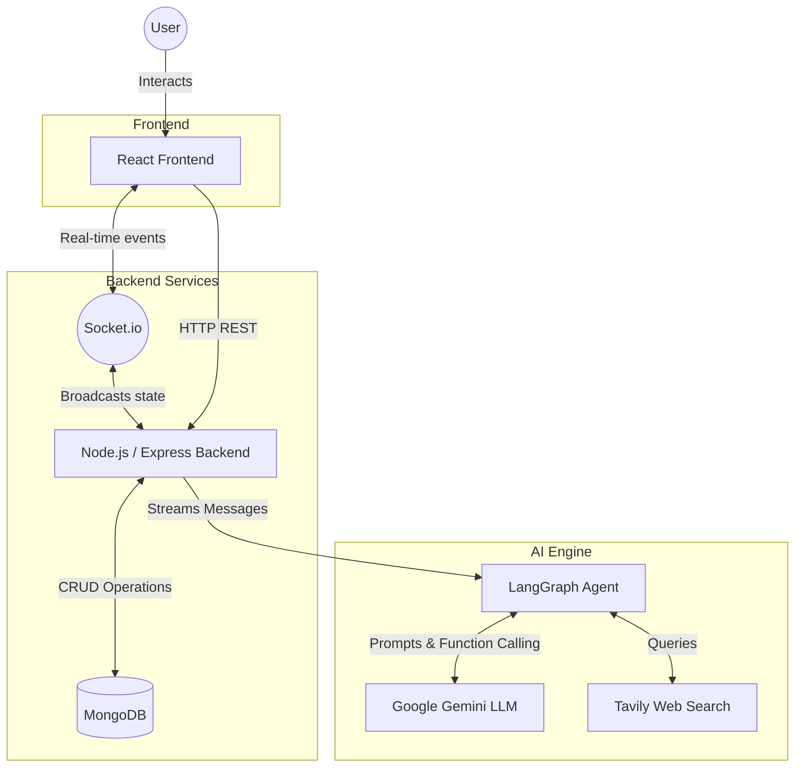

# AI Chat Application

A powerful, real-time AI chat application built with the MERN stack (MongoDB, Express, React, Node.js), Socket.io, and advanced AI agents powered by LangGraph, Google Gemini, and Tavily for web search capabilities.

## Getting Started

Follow these steps to set up and run the application locally.

### Prerequisites
- Node.js (v18+ recommended)
- MongoDB (Local or Atlas URL)
- API Keys: [Google Gemini](https://aistudio.google.com/) and [Tavily](https://tavily.com/)

### 1. Install Dependencies
Open two terminal instances, one for the frontend and one for the backend.

```bash
# Terminal 1: Backend
cd backend
npm install

# Terminal 2: Frontend
cd frontend
npm install
```

### 2. Environment Variables
Create a `.env` file in the `backend/` directory with the following configuration:
```env
PORT=3000
MONGODB_URI=your_mongodb_connection_string
JWT_SECRET=your_jwt_secret
GEMINI_API_KEY=your_gemini_api_key
TAVILY_API_KEY=your_tavily_api_key
```

Create a `.env` file in the `frontend/` directory (if needed for custom API URLs, Vite uses `VITE_` prefix):
```env
VITE_API_URL=http://localhost:3000
```

### 3. Start the Development Servers

```bash
# Terminal 1: Start the backend server (runs via nodemon)
cd backend
npm run dev

# Terminal 2: Start the React frontend (runs via Vite)
cd frontend
npm run dev
```

The application will typically run on `http://localhost:5173` (Frontend) and `http://localhost:3000` (Backend).

## Architecture & Data Flow

The following diagram illustrates the core data flow of the application, encompassing standard HTTP requests for state management, WebSockets for real-time reactivity, and LangGraph integration for autonomous AI web search and response generation.



---

## API Route Documentation

All API routes require the `Authorization` header with a valid Bearer token (`authenticateUser` middleware), except for the Login and Register routes. Base URLs will depend on your local environment setup (e.g., `/api/user`, `/api/chat`, `/api/access`).

### Authentication Routes (`/api/user`)

| Method | Endpoint | Description |
|--------|----------|-------------|
| `POST` | `/register` | Register a new user account. |
| `POST` | `/login` | Authenticate a user and receive a JWT token. |
| `GET`  | `/get-user` | Retrieve the authenticated user's profile. |

### Chat Routes (`/api/chat`)

| Method | Endpoint | Description |
|--------|----------|-------------|
| `POST` | `/create-chat` | Create a new chat session. |
| `GET`  | `/get-chat/:chatId` | Retrieve a specific chat and its messages. |
| `GET`  | `/all` | Get all chats associated with the authenticated user. |

#### Message Features
| Method | Endpoint | Description |
|--------|----------|-------------|
| `POST` | `/message/:messageId/reaction` | Add a reaction to a specific message. |
| `DELETE`| `/message/:messageId/reaction` | Remove a reaction from a specific message. |
| `PUT`  | `/message/:messageId/pin` | Pin a message in the chat. |
| `PUT`  | `/message/:messageId/unpin` | Unpin a message from the chat. |
| `GET`  | `/chat/:chatId/pinned` | Retrieve all pinned messages for a specific chat. |
| `PUT`  | `/message/:messageId/save` | Save a message to the user's personal saved list. |
| `PUT`  | `/message/:messageId/unsave` | Remove a message from the saved list. |
| `GET`  | `/saved-messages` | Retrieve all messages saved by the user. |
| `PUT`  | `/message/:messageId/edit` | Edit the content of an existing message. |

### Access & Permission Routes (`/api/access`)

Manages shared chat viewing and editing permissions between users.

| Method | Endpoint | Description |
|--------|----------|-------------|
| `POST` | `/request` | Request access to a specific chat owned by another user. |
| `GET`  | `/requests/pending` | Get all pending access requests for the owner's chats. |
| `PUT`  | `/requests/:requestId` | Owner approves or rejects an access request. |
| `PUT`  | `/permission/:chatId/:userId`| Owner updates the permission level (e.g., view-only, edit) of a specific user. |
| `GET`  | `/permission/:chatId` | Get the authenticated user's permission level for a specific chat. |

---

## WebSocket Events

Real-time interactions are handled by Socket.io:
- **`join_chat`**: Join a specific chat room.
- **`leave_chat`**: Leave a specific chat room.
- **`send_message`**: Emit a new message to the room.
- **`receive_message`**: Listen for incoming messages from users or the AI.
- **`add_reaction` / `remove_reaction`**: Real-time emission of reaction state changes.
- **`reaction_updated`**: Broadcast to all clients in the room that a message's reactions have changed.
